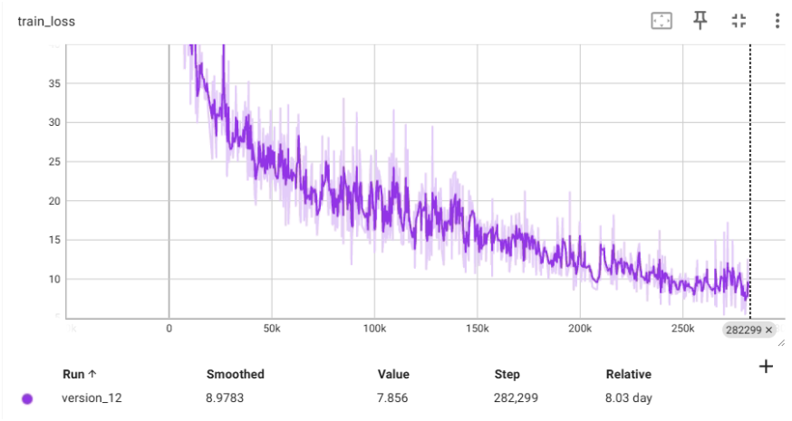

# **QuartzNet Model**

The QuartzNet is a better variant of Jasper with a key difference that it uses time-channel separable 1D convolutions. This allows it to dramatically reduce the number of weights while keeping similar accuracy.

A Jasper/QuartzNet models look like this (QuartzNet model is pictured):


## **Requirements (make sure you follow the exact order)**

- Python 3.10 or above
- PyTorch 1.13.1 or above
- NVIDIA GPU (if you intend to train from scratch)

## **Use Anaconda to Avoid Package Conflicts**

```sh
conda create --name condaEnv python==3.10.12
conda activate condaEnv
```
## **Install pytorch**

```sh
pip3 install torch torchvision torchaudio --index-url https://download.pytorch.org/whl/cu121
```
## **Install Cython**
```sh
pip install Cython packaging
```
## **Install nemo asr library**
```sh
pip install nemo_toolkit['asr']
```
## **Training loss**


## **Validation loss**


## **WER**

